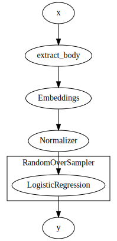

# Sentence classification

In this tutorial we will try to predict whether an SMS is a spam or not. To train our model, we will use the `SMSSpam` dataset. This dataset is unbalanced, there is only 13.4% spam. Let's look at the data:


```python
from river import datasets

datasets.SMSSpam()
```


    SMS Spam Collection dataset.
    
    The data contains 5,574 items and 1 feature (i.e. SMS body). Spam messages represent
    13.4% of the dataset. The goal is to predict whether an SMS is a spam or not.
    
          Name  SMSSpam                                                                              
          Task  Binary classification                                                                
       Samples  5,574                                                                                
      Features  1                                                                                    
        Sparse  False                                                                                
          Path  /Users/home/river_data/SMSSpam/SMSSpamCollection                                     
           URL  https://archive.ics.uci.edu/ml/machine-learning-databases/00228/smsspamcollection.zip
          Size  466.71 KB                                                                            
    Downloaded  True                                                                                 


```python
from pprint import pprint

X_y = datasets.SMSSpam()

for x, y in X_y:
    pprint(x)
    print(f'Spam: {y}')
    break
```

    {'body': 'Go until jurong point, crazy.. Available only in bugis n great world '
             'la e buffet... Cine there got amore wat...\n'}
    Spam: False


Let's start by building a simple model like a Naive Bayes classifier. We will first preprocess the sentences with a TF-IDF transform that our model can consume. Then, we will measure the accuracy of our model with the AUC metric. This is the right metric to use when the classes are not balanced. In addition, the Naive Bayes models can perform very well on unbalanced datasets and can be used for both binary and multi-class classification problems.


```python
from river import feature_extraction
from river import naive_bayes
from river import metrics

def extract_body(x):
    """Extract the body of the sms."""
    return x['body']

X_y = datasets.SMSSpam()

model = (
    extract_body | 
    feature_extraction.TFIDF() | 
    naive_bayes.BernoulliNB(alpha=0)
)

metric = metrics.ROCAUC()
cm = metrics.ConfusionMatrix()

for x, y in X_y:
    
    y_pred = model.predict_one(x)
    
    if y_pred is not None:
        metric.update(y_pred=y_pred, y_true=y)
        cm.update(y_pred=y_pred, y_true=y)
    
    model.learn_one(x, y)
    
metric
```


    ROCAUC: 0.929296


The confusion matrix:


```python
cm
```


               False    True
       False    4809      17
        True     103     644


The results are quite good with this first model.

Since we are working with an unbalanced dataset, we can use the `imblearn` module to rebalance the classes of our dataset. For more information about the `imblearn` module, you can find a dedicated tutorial [here](../imbalanced-learning).


```python
from river import imblearn

X_y = datasets.SMSSpam()

model = (
    extract_body | 
    feature_extraction.TFIDF() | 
    imblearn.RandomUnderSampler(
        classifier=naive_bayes.BernoulliNB(alpha=0),
        desired_dist={0: .5, 1: .5},
        seed=42
    )
)

metric = metrics.ROCAUC()
cm = metrics.ConfusionMatrix()

for x, y in X_y:
    
    y_pred = model.predict_one(x)
    
    if y_pred is not None:
        metric.update(y_pred=y_pred, y_true=y)
        cm.update(y_pred=y_pred, y_true=y)
    
    model.learn_one(x, y)
    
metric
```


    ROCAUC: 0.951728


The `imblearn` module improved our results. Not bad! We can visualize the pipeline to understand how the data is processed.

The confusion matrix:


```python
cm
```


               False    True
       False    4624     201
        True      41     706


```python
model.draw()
```


    

    


Now let's try to use logistic regression to classify messages. We will use different tips to make my model perform better. As in the previous example, we rebalance the classes of our dataset. The logistics regression will be fed from a TF-IDF.


```python
from river import linear_model
from river import optim
from river import preprocessing

X_y = datasets.SMSSpam()

model = (
    extract_body | 
    feature_extraction.TFIDF() | 
    preprocessing.Normalizer() | 
    imblearn.RandomUnderSampler(
        classifier=linear_model.LogisticRegression(
            optimizer=optim.SGD(.9), 
            loss=optim.losses.Log()
        ),
        desired_dist={0: .5, 1: .5},
        seed=42
    )
)

metric = metrics.ROCAUC()
cm = metrics.ConfusionMatrix()

for x, y in X_y:
    
    y_pred = model.predict_one(x)

    metric.update(y_pred=y_pred, y_true=y)
    cm.update(y_pred=y_pred, y_true=y)
    
    model.learn_one(x, y)
    
metric
```


    ROCAUC: 0.946039


The confusion matrix:


```python
cm
```


               False    True
       False    4655     172
        True      54     693


```python
model.draw()
```


    

    


The results of the logistic regression are quite good but still inferior to the naive Bayes model.

Let's try to use word embeddings to improve our logistic regression. Word embeddings allow you to represent a word as a vector. Embeddings are developed to build semantically rich vectors. For instance, the vector which represents the word **python** should be close to the vector which represents the word **programming**. We will use [spaCy](https://spacy.io/) to convert our sentence to vectors. spaCy converts a sentence to a vector by calculating the average of the embeddings of the words in the sentence.

You can download pre-trained embeddings in many languages. We will use English pre-trained embeddings as our SMS are in English.

The command below allows you to download the pre-trained embeddings that spaCy makes available. More informations about spaCy and its installation may be found here [here](https://spacy.io/usage).

```sh
python -m spacy download en_core_web_sm
```

Here, we create a custom transformer to convert an input sentence to a dict of floats. We will integrate this transformer into our pipeline.


```python
import spacy

from river.base import Transformer

class Embeddings(Transformer):
    """My custom transformer, word embedding using spaCy."""
    
    def __init__(self):
        self.embeddings = spacy.load('en_core_web_sm')
        
    def transform_one(self, x, y=None):
        return {dimension: xi for dimension, xi in enumerate(self.embeddings(x).vector)}
```

Let's train our logistic regression:


```python
X_y = datasets.SMSSpam()

model = (
    extract_body | 
    Embeddings() | 
    preprocessing.Normalizer() |
    imblearn.RandomOverSampler(
        classifier=linear_model.LogisticRegression(
            optimizer=optim.SGD(.5), 
            loss=optim.losses.Log()
        ),
        desired_dist={0: .5, 1: .5},
        seed=42
    )
)

metric = metrics.ROCAUC()
cm = metrics.ConfusionMatrix()

for x, y in X_y:
    
    y_pred = model.predict_one(x)
    
    metric.update(y_pred=y_pred, y_true=y)
    cm.update(y_pred=y_pred, y_true=y)
    
    model.learn_one(x, y)

metric
```


    ROCAUC: 0.91568


The confusion matrix:


```python
cm
```


               False    True
       False    4517     310
        True      78     669


```python
model.draw()
```


    

    


The results of the logistic regression using spaCy embeddings are lower than those obtained with TF-IDF values. We could surely improve the results by cleaning up the text. We could also use embeddings more suited to our dataset. However, on this problem, the logistic regression is not better than the Naive Bayes model. No free lunch today.
